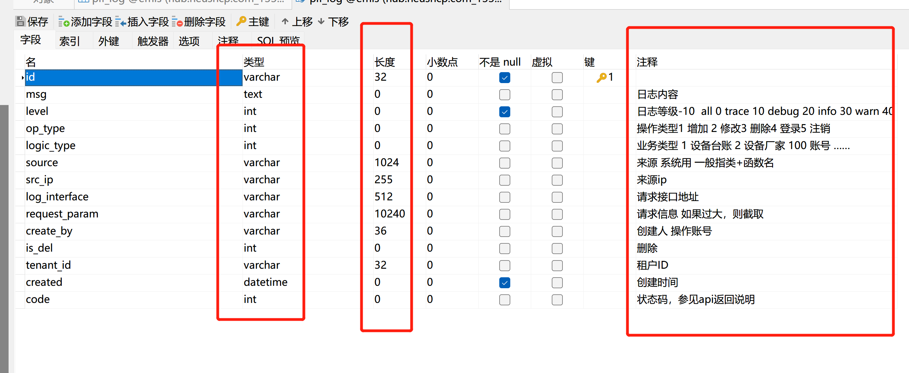

[TOC]


#  primevue #

primevue 类似于elementui，可以通过引用相关的模块设置页面。

今天的需求是设计数据界面，根据datatable设计出页面的基本格式，之后通过插入iuputnumber模块将某些部分设计为可输入数据，这样的话就可以设计出自己想要的页面

感悟：首先要理解例子中模块是怎么设计的，然后按照需求修改。


#  连接MYSQLdb #


资料来自于实验室的同学，写一个博客开始自己写

设计一个数据表

字段就对应前端项目里 那个表格里的列

数据的各个类型

参考 plf_log 那个表的设计 

一般这几种类型就够用了

在 navicat 里 ctrl +D 是设计表的快捷键



****

```
from select import select
conn = MySQLdb.connect(host = self.host, port=self.port, user = self.user, passwd = self.password, db = self.dbname, charset='utf8', autocommit=True) #连接
cursor = conn.cursor()  # 使用游标
cursor.execute(f"ALTER TABLE {self.tablename} ADD  edge_pred real")
cursor.execute(f"ALTER TABLE {self.tablename} ADD  cloud_pred real")
cursor.execute(f"ALTER TABLE {self.tablename} ADD  y_interpolation real")
select
updata
```


```
cursor = conn.cursor()  # 使用游标

//创建train_data数据库

//创建train_data数据库

drop = "drop table if exists train_data"
sql_createTb = """CREATE TABLE train_data (
                 id INT PRIMARY KEY AUTO_INCREMENT,
                 timestamp DATETIME,
                 ak1 real,
                 ak2 real,
                 add_alkali_flow real,
                 slurry_flow real,
                 steam_pressure real,
                 steam_flow real,
                 y real,
                 y_interpolation real)
                 """
cursor.execute(drop)

head1 = "id, timestamp, ak1, ak2, add_alkali_flow, slurry_flow, steam_pressure, steam_flow, y"
cursor.execute(f'select %s from writedata order by `id` desc limit 0,{timestep+ filter_step}'%head1)  # 数据查询最新一个
data = cursor.fetchall()

y_true = y_old+ (y_now - y_old)/num * i  # 得到了最近相邻的阶跃值，进行插值处理

//把y_interpolation写入

cursor.execute(f"update writedata set y_interpolation='{y_true}' where id='{id_old+ i}'") 
cursor.execute(f"update train_data set y_interpolation='{y_true}' where id='{id_old+ i}'") # 插补值写入
```

  


我自己写的代码 增删改查

```
import pymysql
#1 连接数据库
def get_conn():
    conn = pymysql.connect(
    host='',
    port=13306,
    user='root',
    password='',
    db='',
    charset='utf8',

autocommit=True,    # 如果插入数据，， 是否自动提交? 和conn.commit()功能一致。

​     )
​    return  conn
#增加 
def sql_insert_many(sql,args):
  conn = get_conn()
  cur = conn.cursor() # 创建游标
  result = cur.executemany(query=sql, args=args)  
  print(result)
  conn.commit()
  cur.close()
  conn.close()


#删除
def sql_delete(sql,args):
    conn = get_conn()
    cur = conn.cursor()
    result = cur.execute(sql,args)
    print(result)
    conn.commit()
    cur.close()
    conn.close()
#更新
def sql_update(sql,args):
    conn = get_conn()
    cur = conn.cursor()
    result = cur.execute(sql,args)
    print(result)
    conn.commit()
    cur.close()
    conn.close()
#查询
def sql_query(sql,args):
    conn = get_conn()
    cur = conn.cursor()
    cur.execute(sql,args)
    results = cur.fetchall()
    #print(type(results))  # 返回<class 'tuple'> tuple元组类型
​   for row in results:
​        print(row)
​        id = row[0]
​        area_id = row[1]
​        name = row[2]
​        type = row[3]
​        time = row[4]
​        value = row[5]
​        unit = row[6]
​        print(' id: ' + str(id) + ' area_id: ' + str(area_id) + ' name: ' + str(name) +  ' type: ' + str(type) +' time: ' + time +' value: ' + str(value) + 'unit'+str(unit) )
​        pass

​    conn.commit()
​    cur.close()
​    conn.close()


def sql_search():
  conn = get_conn();
  cur = conn.cursor()


  sqli = "select * from plf_data_fuel"
  result = cur.execute(sqli)  
  print(result)
  conn.commit()
  cur.close()
  conn.close()


if __name__=='__main__':
    #sql = 'INSERT INTO plf_data_fuel VALUES(%s,%s,%s,%s,%s,%s,%s);'
    #args = [(0, '公司','选矿','指标','2022.6.11','150','升/千吨'), (1, '公司','采矿','消耗','2022.6.11','200','升')]增加

# sql = 'DELETE FROM plf_data_fuel WHERE id = %s;'
#args = (0,) # 单个元素的tuple写法
sql_delete(sql,args)

sql = 'UPDATE plf_data_fuel SET value=%s WHERE id = %s;'
args = ('150', 0)
sql_update(sql, args)

sql = 'SELECT  * FROM plf_data_fuel;'
sql_query(sql,None)         CHA
```

