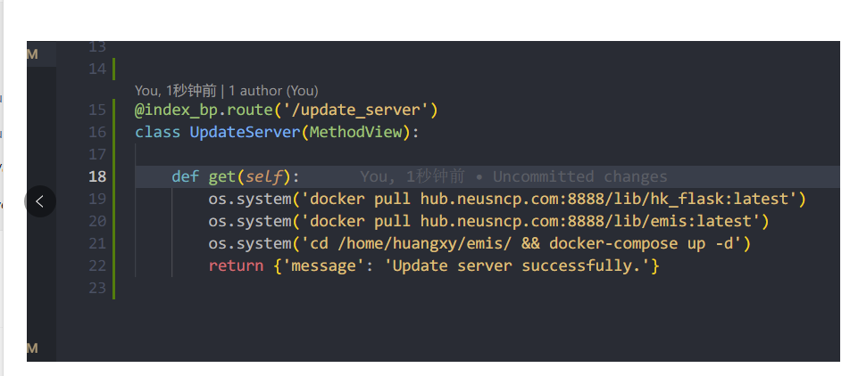
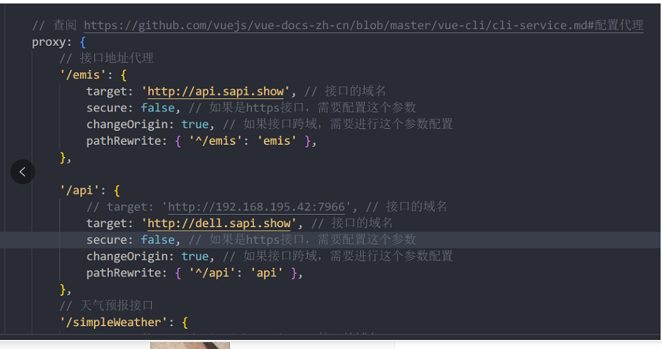
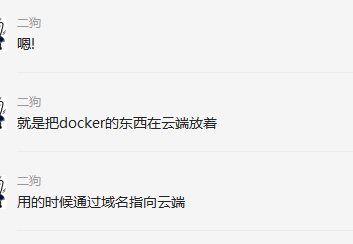
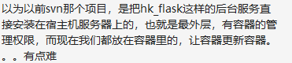

# 待完成 #

ji紧接着上次的docker pull和docker push来说的

因为服务器部署完成后，我们操作服务器很麻烦，要记住很多命令，有时候有防火墙不开放22端口就麻烦了


这时候，可以将命令写到 后台 controller里，然后在浏览器里访问指定的路径，就可以调用命令行执行相应的操作了

以前用SVN的时候，没有本地仓库，提交了之后服务器自动拉取，重启进程，就更新服务器端的程序了

是的，就是你的笔记本里的浏览器就行，访问一个GET请求

本地 docker push 之后，GET请求进入服务器执行 docker pull ，然后 docker run -d -p ...


```
class UpdateServer(MethodView):

    def updateServer(self):
        os.system('docker pull hub.neusncp.com:8888/lib/hk_flask:latest')
        os.system('docker pull hub.neusncp.com:8888/lib/emis:latest')
          os.system('cd /home/huangxy/emis/ && docker-compose up -d')
        return {'message': 'Update server successfully.'}
```






这部分很重要，告诉前台，访问API的时候，如果是以 emis 开头的，那就把请求转发到 api.sapi.show 这里

docker给不了域名，域名是我向网络运营商租用的，也就是给钱，告诉DNS厂商，这个域名指向某个服务器IP

嗯嗯，docker是一个容器，可以放在自己的电脑上，也可以放在阿里云，腾讯云这种托管的服务器上，一次开发到处移植



https://neuhxy90.github.io/2022/06/07/%E9%A1%B9%E7%9B%AE/%E9%A1%B5%E9%9D%A2%E7%82%B9%E5%87%BB%E6%8C%89%E9%92%AE%E5%AE%9E%E7%8E%B0%E7%B3%BB%E7%BB%9F%E5%9C%A8%E7%BA%BF%E5%8D%87%E7%BA%A7/


http://dell.sapi.show/docs





docker build, push, pull 这种都是操作镜像，也就是相当于系统安装盘.iso

docker run -d ...这个操作相当于买了一个新电脑，并且用你build的系统安装盘给新装个系统*

现在我们的操作，相当于升级了系统安装盘，但是我们是在一个笔记本里，自己更新自己

，如果我们把 hk_flask 安装在宿主机里就行了

这样可以单独写一个服务，专门用来升级用

在系统内通过http请求，自己更新自己，是可以的

就是还得配置好

通过博客记录的那个方法，能掌握怎么写新的接口了
