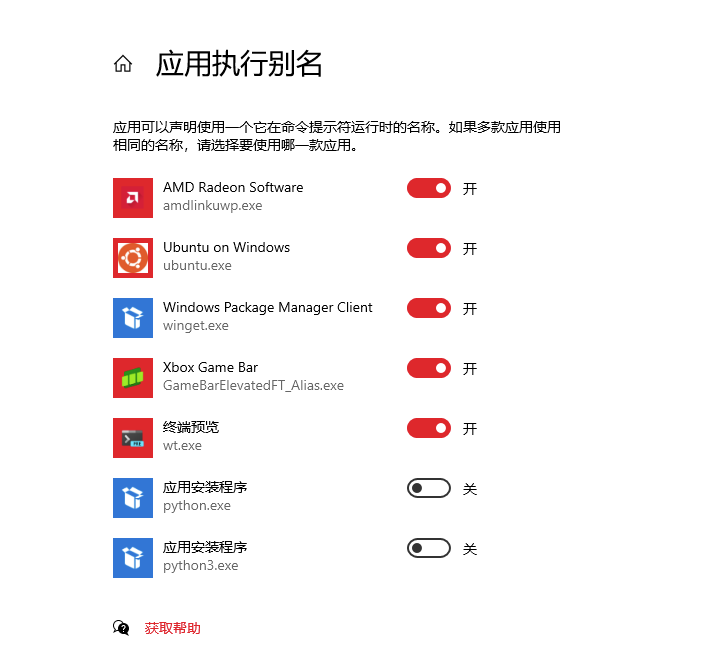

[TOC]


# win10用命令行运行python脚本 #

1.解决输入pyhton后转入microsoft store 

（1）将anaconda加入环境变量中

此电脑右键→属性→*关于*下面的*高级系统设置*→对*用户变量和*系统变量*的*path*进行编辑→新建三个anaconda环境变量（最下面的三个）


（2）windows搜索栏输入管理应用执行别名→应用安装程序python取消勾选




2.打开cmd命令行

（1）输入python代表进入python交互模式，可以通过输入代码得到相应的结果。

如果输入python没有进入交互模式，因为本机用的是anaconda，所以输入

`conda info --envs`
查看环境


将py3虚拟环境激活：

`conda activate py3`


激活后自动进入python虚拟环境，此时进入了交互模式

（2）进入.py文件所在的位置，打开cmd命令行，（等价于在当前文件夹右键打开windows powershell）输入python test.py，可以运行python脚本，例如：


# python调用cmd #

3种方式

## 1.python的OS模块 ##

os模块调用cmd命令有两种方式：**os.system()**、**os.popen()**都是用当前进程来调用。

-（1）**os.system()**是无法获取返回值的。当运行结束后接着往下面执行程序。

`import os`

`os.system("ipconfig")`

<u>报错并显示：</u>


<u>这个显示的是cmd下的结果，解决方案：</u>

<u>配置默认终端为powershell</u>

<u>打开终端→选择默认配置文件→选择powershell→运行程序即可</u>

<u>ps：之后再将默认终端换为cmd时发现不再报错。。。</u>


-（2）os.popen()带返回值的，如何获取返回值。如：

```
import os
cmd='python'
p = os.popen(cmd)
Output_str = p.read()
print (Output_str)
```

得到的是个字符串。

这两个都是用当前进程来调用，它们都是阻塞式的。


（1）首先理解括号里面的程序

cd /××/××  进入文件夹

svn update
注：后面也可以指定目录
如果命令后无目录，则将当前目录及其子目录下的所有文件都更新到最新版本。 

python manage.py db migrate

python manage.py db upgrade

实际开发中使用flask-migrate来动态的迁移数据库，使用flask-migrate必须借助flask-script

Pid 文件是包含进程标识号 (pid) 的文件，该文件存储在文件系统的明确定义位置，因此允许其他程序找出正在运行的脚本的 pid。

下面两种方法仅是记录。

## 2.管道subprocess模块（使用Popen模块产生新的process） ##

~~运行原理会在当前进程下面产生子进程。~~

```
sub=subprocess.Popen(cmd,shell=True,stdout=subprocess.PIPE)
sub.wait()
print sub.read()
```

~~现在大部分人都喜欢使用Popen。Popen方法不会打印出cmd在linux上执行的信息。的确，Popen非常强大，支持多种参数和模式。使用前需要from subprocess import Popen, PIPE。但是Popen函数有一个缺陷，就是它是一个阻塞的方法。如果运行cmd时产生的内容非常多，函数非常容易阻塞住。解决办法是不使用wait()方法，但是也不能获得执行的返回值了。~~

~~Popen原型是：~~

~~[python]~~

~~subprocess.Popen(args, bufsize=0, executable=None, stdin=None, stdout=None, stderr=None, preexec_fn=None, close_fds=False, shell=False, cwd=None, env=None, universal_newlines=False, startupinfo=None, creationflags=0)~~

~~参数bufsize：指定缓冲。我到现在还不清楚这个参数的具体含义，望各个大牛指点。~~

~~参数executable用于指定可执行程序。一般情况下我们通过args参数来设置所要运行的程序。如果将参数shell设为 True，executable将指定程序使用的shell。在windows平台下，默认的shell由COMSPEC环境变量来指定。~~

~~参数stdin, stdout, stderr分别表示程序的标准输入、输出、错误句柄。他们可以是PIPE，文件描述符或文件对象，也可以设置为None，表示从父进程继承。~~

~~参数preexec_fn只在Unix平台下有效，用于指定一个可执行对象(callable object)，它将在子进程运行之前被调用。~~

~~参数Close_sfs：在windows平台下，如果close_fds被设置为True，则新创建的子进程将不会继承父进程的输入、输出、错误管 道。我们不能将close_fds设置为True同时重定向子进程的标准输入、输出与错误(stdin, stdout, stderr)。~~

~~如果参数shell设为true，程序将通过shell来执行。~~

~~参数cwd用于设置子进程的当前目录。~~

~~参数env是字典类型，用于指定子进程的环境变量。如果env = None，子进程的环境变量将从父进程中继承。~~

~~参数Universal_newlines:不同操作系统下，文本的换行符是不一样的。如：windows下用’/r/n’表示换，而Linux下用 ‘/n’。如果将此参数设置为True，Python统一把这些换行符当作’/n’来处理。~~

~~参数startupinfo与createionflags只在windows下用效，它们将被传递给底层的CreateProcess()函数，用 于设置子进程的一些属性，如：主窗口的外观，进程的优先级等等。~~

~~subprocess.PIPE 在创建Popen对象时，subprocess.PIPE可以初始化stdin, stdout或stderr参数，表示与子进程通信的标准流。~~

~~subprocess.STDOUT 创建Popen对象时，用于初始化stderr参数，表示将错误通过标准输出流输出。~~

~~Popen的方法：~~

~~Popen.poll()  用于检查子进程是否已经结束。设置并返回returncode属性。~~

~~Popen.wait()  等待子进程结束。设置并返回returncode属性。~~

~~Popen.communicate(input=None) 与子进程进行交互。向stdin发送数据，或从stdout和stderr中读取数据。可选参数input指定发送到子进程的参数。 Communicate()返回一个元组：(stdoutdata, stderrdata)。注意：如果希望通过进程的stdin向其发送数据，在创建Popen对象的时候，参数stdin必须被设置为PIPE。同样，如 果希望从stdout和stderr获取数据，必须将stdout和stderr设置为PIPE。~~

~~Popen.send_signal(signal)  向子进程发送信号。~~

~~Popen.terminate() 停止(stop)子进程。在windows平台下，该方法将调用Windows API TerminateProcess()来结束子进程。~~

~~Popen.kill() 杀死子进程。~~

~~Popen.stdin  如果在创建Popen对象是，参数stdin被设置为PIPE，Popen.stdin将返回一个文件对象用于策子进程发送指令。否则返回None。~~

~~Popen.stdout  如果在创建Popen对象是，参数stdout被设置为PIPE，Popen.stdout将返回一个文件对象用于策子进程发送指令。否则返回 None。~~

~~Popen.stderr  如果在创建Popen对象是，参数stdout被设置为PIPE，Popen.stdout将返回一个文件对象用于策子进程发送指令。否则返回 None。~~

~~Popen.pid  获取子进程的进程ID。~~

~~Popen.returncode  获取进程的返回值。如果进程还没有结束，返回None。~~

~~例如：~~

~~[python]~~

~~p = Popen("cp -rf a/* b/", shell=True, stdout=PIPE, stderr=PIPE)~~

~~p.wait()~~

~~if p.returncode != 0:~~

~~print "Error."~~

~~return -1~~
~~————————————————~~
~~版权声明：本文为CSDN博主「Sahadhammika」的原创文章，遵循CC 4.0 BY-SA版权协议，转载请附上原文出处链接及本声明。~~
~~原文链接：https://blog.csdn.net/weixin_28419039/article/details/112825756~~

## 3.使用commands.getstatusoutput('cmd')方法 ##

```
status ,output = commands.getstatusoutput('cmd')
status = commands.getstatus('cmd')
output = commands.getoutput('cmd')
```

~~顾名思义，status，output分别是执行的状态和输出结果，但是这种方法在windows中不能用。这个方法也不会打印出cmd在linux上执行的信息。这个方法唯一的优点是，它不是一个阻塞的方法。即没有Popen函数阻塞的问题。使用前需要import commands。~~

~~例如：~~

~~[python]~~

~~status, output = commands.getstatusoutput("ls")~~

~~还有只获得output和status的方法：~~

~~[python]~~

~~commands.getoutput("ls")~~

~~commands.getstatus("ls")~~
————————————————
~~版权声明：本文为CSDN博主「Sahadhammika」的原创文章，遵循CC 4.0 BY-SA版权协议，转载请附上原文出处链接及本声明。~~
~~原文链接：https://blog.csdn.net/weixin_28419039/article/details/112825756~~


