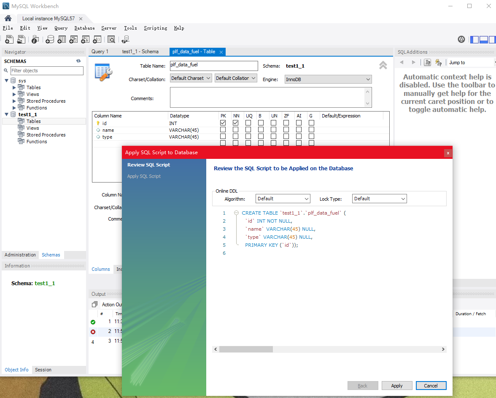

> 

## MYsql数据库(安装教程) ##

在mysql官网下载（community）mysql5.7.38版本     

#### -1 installer安装教程  [参考教程](https://zhuanlan.zhihu.com/p/188416607) ####

```
root  a1b2c3dd
```


customs  选择下一步后excute（workbench是前端交互界面）


剩下的直接一路点下去

#### -2 配置环境变量 ####

第一步安装的时候数据库管理系统的安装路径：


我选的是D盘。


找到D盘中的文件，其中有很多二进制可执行文件，利用命令行cmd打开mysql.exe，在cmd中，不管是否配置环境变量都可以执行这个文件，当不配置环境变量，就只是切换到mysql.exe的目录下，才能执行mysql的启动命令，当配置了环境变量，只要打开了cmd，就可以任意一个路径下执行mysql的启动命令。

我的电脑→属性→高级→环境变量→**a）在系统变量中直接创建MYSQL_HOME**+**b）系统变量中选择path**


a)系统变量中新建**MYSQL_HOME**


b)将server的路径（打开bin后可以直接右键复制路径）添加到系统变量的path中  网上的教程是：**%MYSQL_HOME%\bin** 


网上的教程是先配置系统变量，再配置系统变量中的path→**%MYSQL_HOME%\bin** 

配置完成后cmd显示


## 使用mysql workbench操作数据库 ##

本文教程在下载mysql时就已经下载了workbench，所以这里不需要再下载


输入密码登录mysql，进入数据库可以看到


#### -1 新建数据库 ####


name时名称

下面是编码方式，设置完成后点击apply


会自动生成创建数据库的语句，再次点击apply即可

之后可以在侧边navigator看到新建的数据库，如果看不到，可以选择底部的administration变为schemas。


#### -2 对数据库的增删改查 ####

（1）设置连接

选中刚建好的数据库，右键，设置为此次链接的默认数据库


（2）新建表格：菜单栏第五个图标/选中新建的数据库中的tables右键中create table 


新建表格的项目中添加column，设置column的datatype，primarykey等属性，之后点击执行。

点击apply还会自动生成SQL语句




点击表旁边的小信号就可以查看表目前的各种信息，即数据表的结构。

（3）查看表格数据

选中表格→右键→选择select rows

（4）修改表格数据

双击表格中的null，输入数据，输入完成后点击右下角apply


#### 插入中文时报错 ####

可能是表的设置问题：报错1366


解决办法（1）：修改表格的编码方式为uft8后apply，+修改当前行的编码方式为utf8后apply. 找到表名或者列名的小信息符号


（在workbench中使用这种方式）


（2）修改my.ini文件


cmd ：

```
 show  variables like ‘character%’；
```

看到server的编码模式不是utf8 。

网上的教程是在mysqldata的安装目录下找到my.ini文件，在安装过程中设置了mysqldata的安装路径，这个时候找到安装路径，就可以看到my.ini文件


用打开文本的方式打开，找到mysql下面的


去掉default前面的井号，等号后面加上utf8，

再找到mysqld下面的

如最后一行所示，如上述操作一样。

完成后重启mysql服务:

win+r 输入services.msc，其中找到mysql，本地用的是


```
net stop MySQL57

net start MySQL57
```

**如果不行的话，可以用管理员方式打开cmd。**


错误原因：

1 提示服务名无效→查看windows下mysql服务的名称，如上图所示。

2 提示发生系统错误5 拒绝访问→未用管理员模式打开。    

#### 各种约束 ####

1. 主键约束，pk列即表示可操作数据表的主键约束，当勾选pk复选框时，该列就是数据表的主键。
2. 外键约束，foreign key name，进入 Foreign Keys 标签，首先在 Foreign Key Name 中填入外键名称，其次在 Referenced Table 中选择当前数据库中的数据表，然后选择设置外键的字段，接着选择主表的关联字段，最后单击 Apply 按钮即可完成外键的添加操作，如下图所示。
3. 唯一约束：UQ列表示数据表的唯一约束，当勾选UQ复选框时，代表该列就是数据表的唯一约束索引。
4. 默认值约束：Default/Expression 列中编辑字段的默认值。（NULL/数字..）
5. 非空约束：NN列表示数据表的非空约束，当勾选NN复选框时，表示该列为数据表的非空约束。

#### -3 数据库中的账号管理 ####

菜单栏server→Users and Privileges 


点击add acount可以创建新的用户，其中右边的设置包括用户名称、验证类型，主机名称，密码，确认密码。

点击delete可以删除用户。

点击refresh可以刷新现在的用户。

## 将数据库映射到本地ip上 ##

供给局域网中的其他用户使用

http://t.zoukankan.com/diyunfei-p-6930794.html
